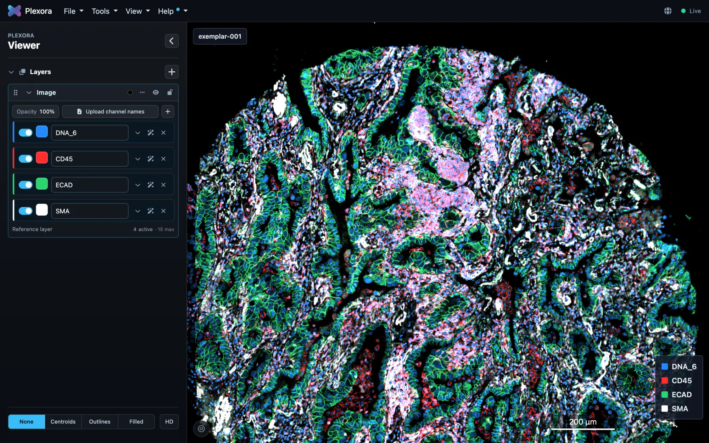

# Plexora


Plexora is a viewer for multiplexed imaging and spatial transcriptomics. It
opens large images where they are, without converting or copying them, draws
segmentation masks and cell tables over them, and runs on a laptop, in a
notebook, on a remote workstation or on an HPC cluster.

**Documentation: https://nirmallab.github.io/plexora/**



## Install

```bash
pip install plexora
plexora
```

`plexora` starts the viewer and opens it in your browser. Python 3.12 or 3.13
is required. A desktop app for macOS, Windows and Linux is on the
[releases page](https://github.com/nirmallab/plexora/releases). See
[Installation](https://nirmallab.github.io/plexora/docs/getting-started/installation/).

## Quick start

In the app, choose **File → Import Sample…** and pick an image, a folder of
files, or a Xenium or Visium run. From Python:

```python
import plexora

name = plexora.import_sample("slide.ome.tif", "slide_mask.tif", "cells.csv", wait=True)
plexora.view(name)   # in a notebook, shows the viewer inline
```

More in the [quick start](https://nirmallab.github.io/plexora/docs/getting-started/quick-start/).

## What it reads

- Multiplexed images: OME-TIFF, TIFF, QPTIFF, OME-Zarr (local, `https://` or `s3://`)
- Brightfield whole-slide images: SVS, NDPI, SCN, BIF, MRXS, DICOM
- 10x Genomics Xenium, Visium and Visium HD output folders
- SpatialData stores and AnnData tables; CSV, TSV and Parquet cell tables
- Segmentation masks (label images) and cell boundary polygons

The full list is in [Supported formats](https://nirmallab.github.io/plexora/docs/reference/supported-formats/).

## Where to go next

| I want to | Read |
| --- | --- |
| Use the viewer and its tools | [Viewer](https://nirmallab.github.io/plexora/docs/viewer/navigation/), [Tools](https://nirmallab.github.io/plexora/docs/plugins/) |
| Script it from Python or a notebook | [Python](https://nirmallab.github.io/plexora/docs/python/), [Notebooks](https://nirmallab.github.io/plexora/docs/notebooks/) |
| Look at data on a remote machine or cluster | [Remote and HPC](https://nirmallab.github.io/plexora/docs/remote/) |
| Write a plugin | [Plugin development](https://nirmallab.github.io/plexora/docs/plugin-development/) |
| Look up a function or command | [Python API](https://nirmallab.github.io/plexora/docs/python-api/), [Command line](https://nirmallab.github.io/plexora/docs/cli/) |

## Developing Plexora

```bash
git clone https://github.com/nirmallab/plexora.git
cd plexora
pip install -e ".[dev]"
python -m pytest -q -p no:randomly
```

See [Development setup](https://nirmallab.github.io/plexora/docs/contributing/development-setup/)
and, for the documentation site in `website/`, [CONTRIBUTING_DOCS.md](./CONTRIBUTING_DOCS.md).
Engineering notes live in [docs/internal/](./docs/internal/).

## Usage data

Plexora can send **anonymous usage counts** -- which features and plugins are
used, how long tiles take to draw, which kinds of errors occur -- so we know
what to improve. It never sends file, project, marker or gene names, cell
data, coordinates, usernames, machine names, paths, prompts or anything typed
into a tool; every field it may send is on an allowlist
(`plexora/telemetry/schema.py`). Everything is queued on this machine first,
nothing in Plexora waits for it, and it works air-gapped exactly as before.

It is on by default and a notice says so the first time. Any one of these turns
it off:

```bash
plexora telemetry off        # or: Settings > Usage data
export DO_NOT_TRACK=1        # honoured everywhere
export PLEXORA_TELEMETRY=off
```

`plexora telemetry preview` prints exactly what the next upload would contain,
and `plexora telemetry status` says which of the above is in force.
[docs/TELEMETRY.md](./docs/TELEMETRY.md) has the details.

## Free and Paid

**Free** is everything described above: every image, table and modality, every
tool's manual features, remote, HPC and notebook viewing, and export. It needs no
account, no activation and no network, and it never asks.

**Paid** adds AI features: guided gating sessions an agent runs with you, and
the evidence and analysis tools it uses. Licences, devices and AI credits are
managed on the BioCognia platform, which Plexora shares with SCIMAP Pro: you
sign in at [account.biocognia.com](https://account.biocognia.com), never in
Plexora. In Settings > License, **Connect this device** shows a short code and
opens the page to approve it; or, from a terminal:

```bash
plexora license status
plexora license activate                       # this computer: prints a code to approve in the browser
plexora license activate BIOC-XXXX-XXXX        # with a code made in the portal, no browser needed
plexora license activate --cluster --name O2   # a whole HPC cluster, once, from a login node
plexora license install lab.bioc               # an offline licence file
plexora license trial                          # 30 days of Paid
```

A licence check sends the licence certificate and a hash that identifies the
device. It never sends your data, file names, machine names or anything
about what you are looking at. When a licence ends, everything Free keeps
working, and every gate, ROI, figure and export you made, with or without AI,
stays yours and editable. AI model providers your agent uses bill you
separately. [docs/LICENSING.md](./docs/LICENSING.md) has the details.

## License

Plexora is released under the **Plexora Academic License 1.0** (see [LICENSE](./LICENSE)).
It is **not** an open source license. In short:

| | |
|---|---|
| Academic research, teaching, personal study | ✅ Free |
| Use by a nonprofit or government research institution | ✅ Free (whatever the funding source) |
| Redistributing Plexora unmodified, with the license attached | ✅ Allowed |
| Patching your own copy to fix a bug or a compatibility problem | ✅ Allowed |
| Publishing a fork, a patched build, or a renamed version | ❌ Not allowed |
| Commercial use of any kind | ❌ Requires a paid license |

**Plugins are a deliberate exception.** Anything you build against the documented
extension interfaces — the `plexora.plugins` entry point group and the `plexora.api`
package — is yours. You may distribute and sell your plugin under whatever license
you like, and you do not need our permission. Extending Plexora through the plugin
API is the supported way to change what it does; editing its source is not.

For a commercial license, contact Ajit Johnson Nirmal <ajitjohnson.n@gmail.com>.

Some bundled components carry their own licenses, which are unaffected by the above —
see section 8 of [LICENSE](./LICENSE).
